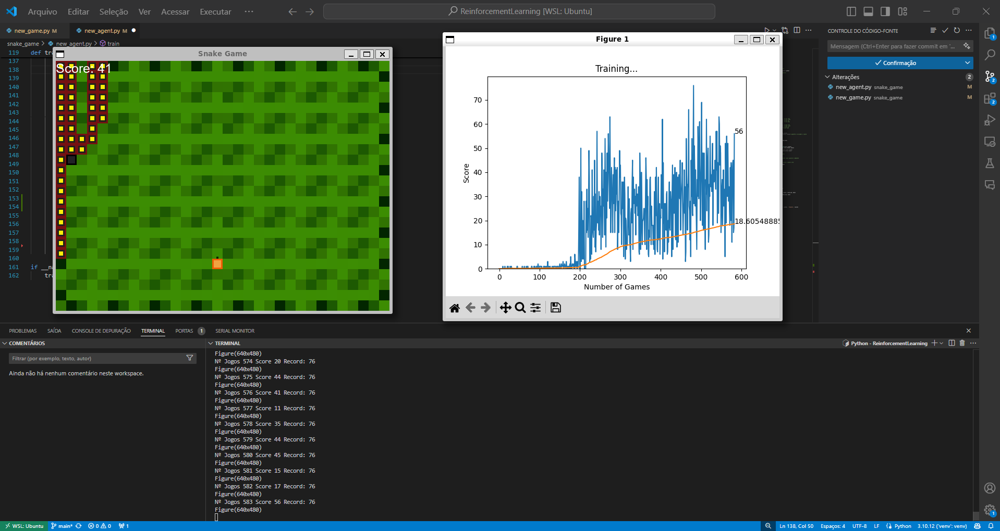

# Jogo da Cobra com Aprendizado por Reforço

Este projeto implementa um jogo da cobra (Snake Game) usando técnicas de Aprendizado por Reforço (Reinforcement Learning). O modelo é treinado para controlar os movimentos da cobra, aprendendo a sobreviver por mais tempo e a marcar mais pontos, evitando obstáculos e comendo a comida.

## Índice

1. [Visão Geral do Projeto](#visão-geral-do-projeto)
2. [Estrutura dos Arquivos](#estrutura-dos-arquivos)
3. [Funcionamento do Jogo](#funcionamento-do-jogo)
4. [Como Executar](#como-executar)
5. [Créditos](#créditos)

## Visão Geral do Projeto

O projeto utiliza uma abordagem de aprendizado por reforço para treinar um agente a jogar o clássico jogo da cobra. A interface gráfica do jogo é construída com Python, e a inteligência do agente é desenvolvida utilizando técnicas de redes neurais e aprendizado por reforço, como o DQN (Deep Q-Network).

## Estrutura dos Arquivos

Abaixo está a descrição dos principais arquivos e diretórios do projeto:

- **assets/**
  - `arial.ttf`: Fonte usada no jogo para exibir textos.
  - `explosion.png`: Imagem exibida quando o jogo termina.
  - `grass.png`: Textura usada como fundo do jogo.

- **model/**
  - `new_agent.py`: Contém a classe do agente responsável por tomar decisões no jogo, utilizando aprendizado por reforço.
  - `new_game.py`: Implementa a lógica principal do jogo da cobra, incluindo o loop do jogo e as regras.
  - `new_helper.py`: Inclui funções auxiliares utilizadas no projeto.
  - `new_model.py`: Implementa a arquitetura de rede neural usada pelo agente para tomar decisões.
  - `new_snake_game_human.py`: Permite jogar o jogo da cobra manualmente (controlado por um humano) para comparação com o agente.

- **README.md**: Este arquivo, que explica o projeto e como utilizá-lo.

## Funcionamento do Jogo

O objetivo do jogo é controlar a cobra para comer a comida e crescer o máximo possível, evitando colidir com as bordas ou com o próprio corpo. O jogo é renderizado usando imagens e fontes incluídas na pasta `assets`. O agente, implementado com uma rede neural, aprende a jogar por tentativa e erro, usando um modelo de aprendizado por reforço.



## Como Executar

```
git clone https://github.com/seuusuario/snake_game_rl.git
pip install -r requirements.txt 
python model/new_snake_game_human.py # para jogar
python model/new_agent.py # para treinar
 ```

## Créditos

Este projeto foi inspirado por um vídeo do canal [freeCodeCamp.org](https://www.youtube.com/watch?v=L8ypSXwyBds) no YouTube, que implementa uma abordagem similar para o jogo da cobra usando aprendizado por reforço. O código original está disponível no [GitHub do Patrick Loeber](https://github.com/patrickloeber/snake-ai-pytorch).

Fiz diversas modificações para aprimorar o aprendizado do agente e personalizar o jogo de acordo com meus objetivos. Agradeço ao Patrick Loeber pela base do código e pela inspiração para desenvolver este projeto.